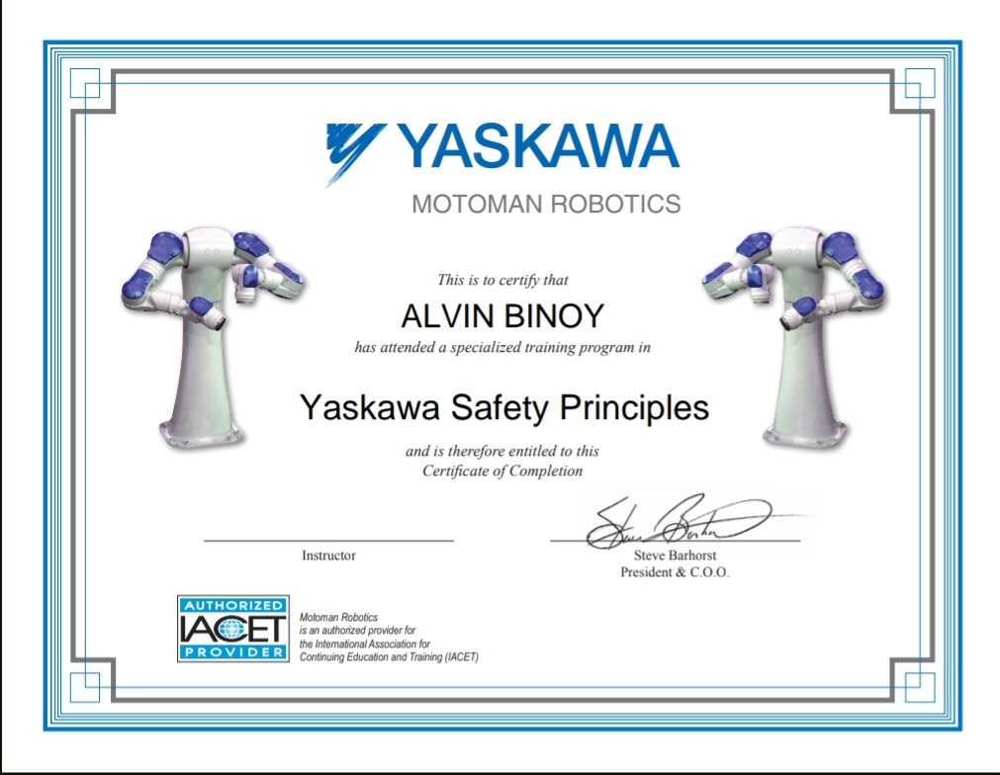
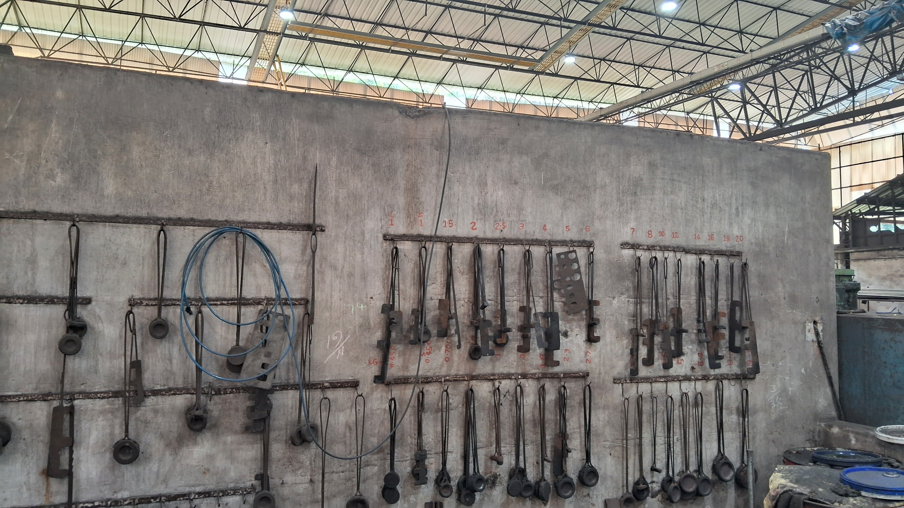
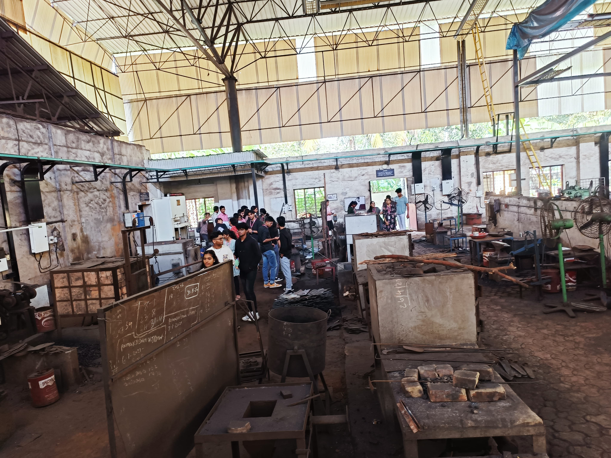
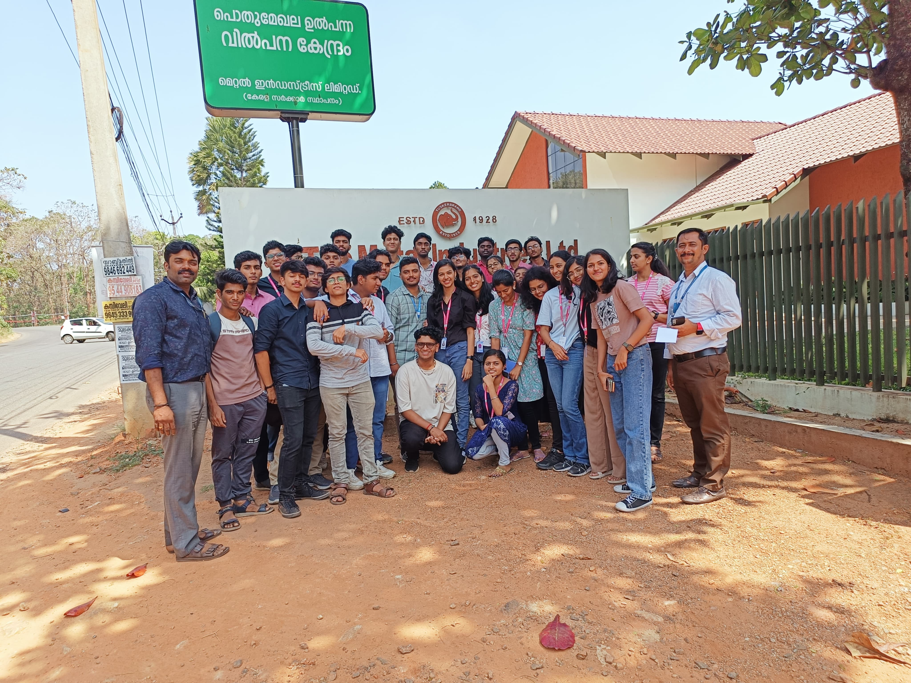
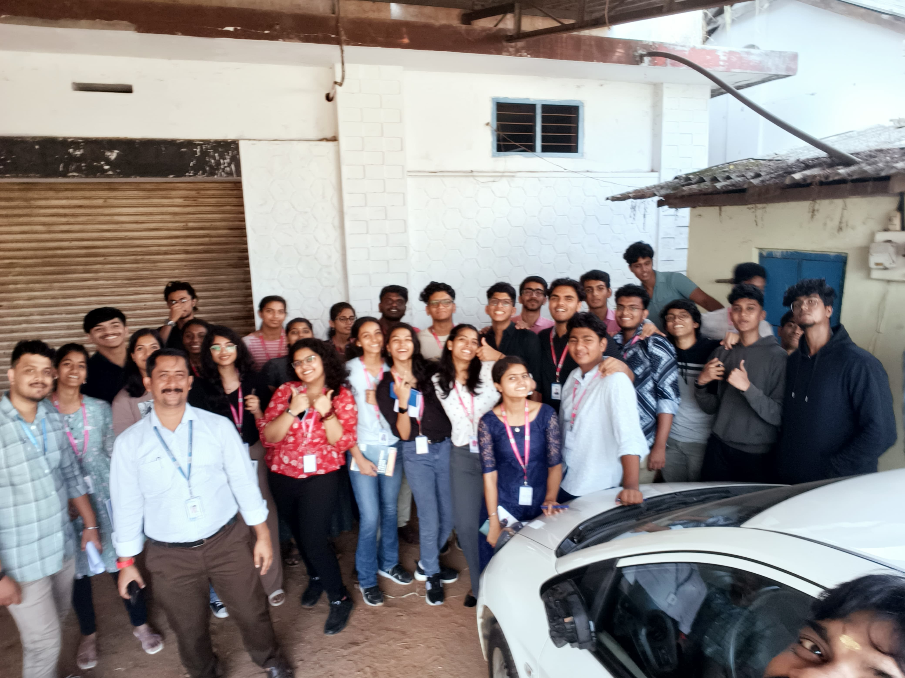
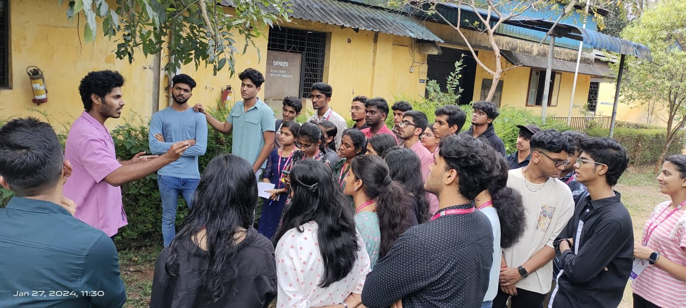
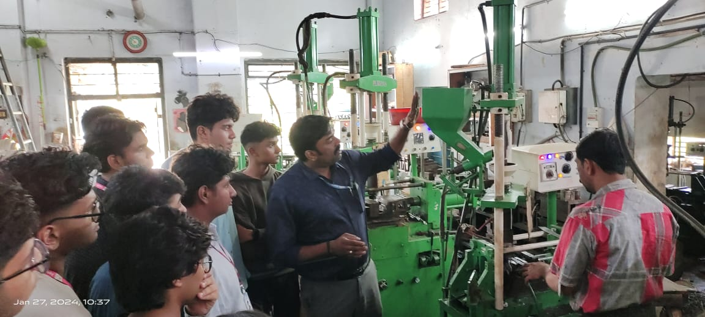

# Tata IIIC Internship January 2024

##### TATA- Jyothi IIIC organized  a Week long internship program aimed at providing insights into 3D printing and designing, Industrial Robotics, Injection molding, and a one-day industrial visit.

### Day 1
   * Basics of Robotics
   * Introduction to Industrial Robots
   * Tinkercad 
   * **Github** - Introduction to Markdown
  
### Day 2
   * Operating a pick and place robot
   * Operating a welding robot
   * Specialized training program in **Yaskawa Safety Principles**
     
   * Intoduction to **Creo** - a 3D designing software

### Day 3
   * Welding practice on a welding robot
   * Building various parts of ball bearing and assembling it using **Creo**

### Day 4
   * Work from home day of creating a github post documenting the internship

### Day 5
   * Industrial visit at Kallippadam - **Vijaya Polymers** and **The Metal Industries**
   * Some photographs from the Industrial Visit
     
     
     
     
     
     
     
